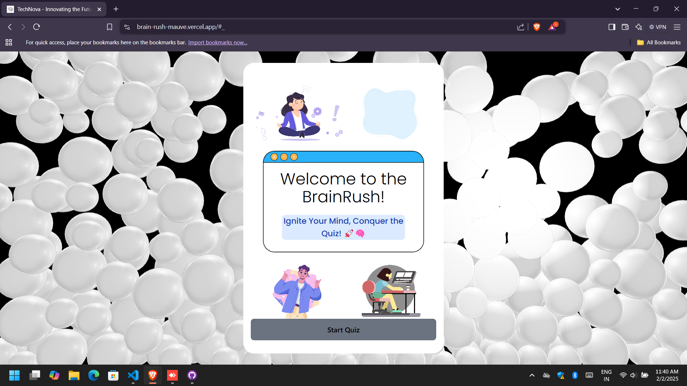
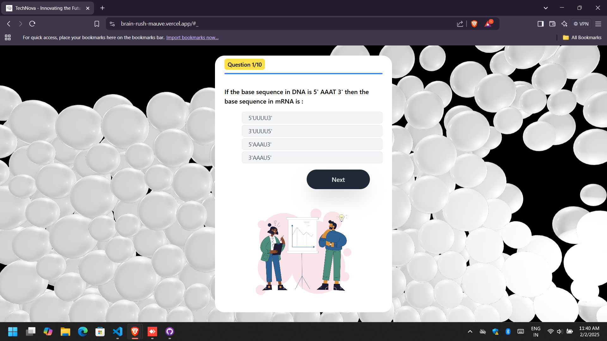
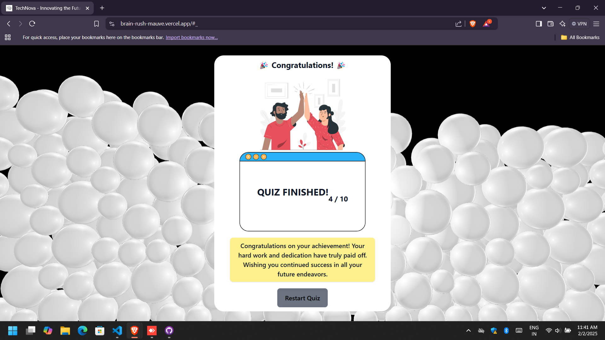

# **BrainRush - A Gamified Web-Based Quiz App** 🧠⚡  

**BrainRush** is an interactive quiz application that combines learning with gamification to create an engaging experience. Users can take quizzes, earn points, and track their progress through a dynamic interface.  

## **🚀 Features**  
✅ Fetches quiz data from an API endpoint: [API Link](https://api.jsonserve.com/Uw5CrX)  
✅ Multiple-choice questions with real-time feedback  
✅ Score summary and analytics upon quiz completion  
✅ Gamification elements like points, leaderboards, and badges *(optional)*  
✅ Clean and intuitive user interface  

## **🛠 Tech Stack**  
- Frontend: React 
- Styling: Tailwind CSS / Bootstrap / Custom CSS  
- API Integration: Fetch API / Axios  

## **📌 Setup Instructions**  
1. Clone the repository:  
   ```bash
   git clone https://github.com/yourusername/brainrush.git
   ```  
2. Navigate to the project directory:  
   ```bash
   cd brainrush
   ```  
3. Install dependencies:  
   ```bash
   npm install
   ```  
4. Start the development server:  
   ```bash
   npm start
   ```  

## **📷 Screenshots & Demo**  
### 1. Home Page


### 2. Quiz


### 3. Result



